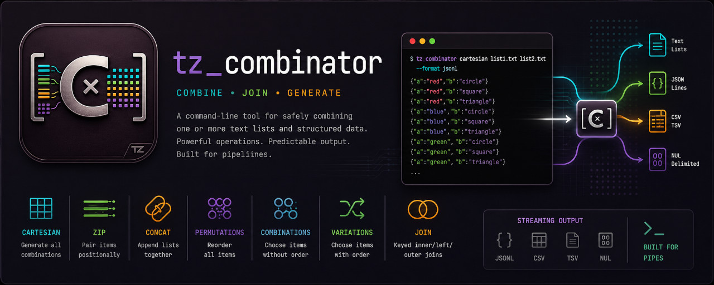
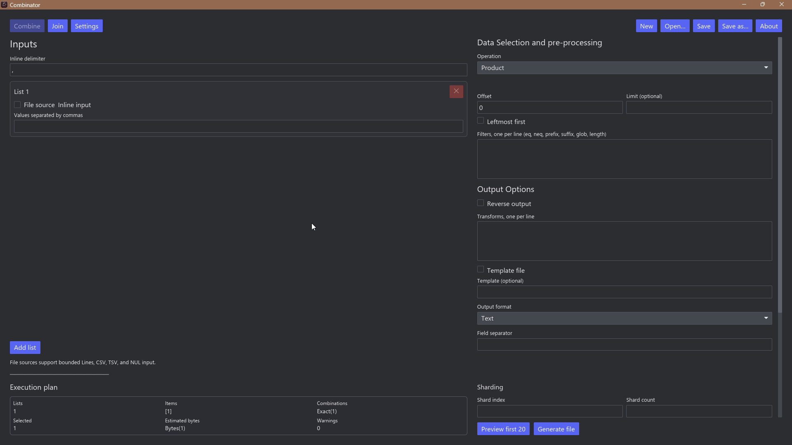

# tz_combinator

[](https://github.com/taggedzi/tz_combinator/actions/workflows/security.yml)
[](https://github.com/taggedzi/tz_combinator/releases/latest)
[](rust-toolchain.toml)
[](LICENSE)
[](docs/release.md)

`tz_combinator` safely combines text lists and structured data. Use the
`combinator` command-line interface (CLI) for scripts and automation, the
desktop graphical user interface (GUI) for visual workflows, or the terminal
user interface (TUI) for keyboard-driven work.

The tool can generate:

- a [Cartesian product](docs/glossary.md#cartesian-product) of several lists;
- positional zips and sequential concatenations;
- permutations, combinations, and variations from one input pool; and
- keyed joins between CSV, TSV, or JSON Lines files.

All interfaces provide bounded input and output, deterministic ordering,
streaming generation, and safe file replacement.

## Quick start

Build all three interfaces:

```text
cargo build --release --locked
```

The binaries are written to `target/release/`:

| Interface | Binary | Best for |
|---|---|---|
| CLI | `combinator` | Scripts, pipelines, and automation |
| GUI | `combinator-gui` | Visual setup, previews, and reusable profiles |
| TUI | `combinator-tui` | Keyboard-first terminal workflows |

Create every color-and-vehicle pair with the CLI:

```console
$ combinator --list "red,blue" --list "car,bike" --sep "-"
red-car
red-bike
blue-car
blue-bike
```

Each repeated `--list` supplies one input list. The default operation selects
one item from each list and emits every possible record. The rightmost list
changes fastest.

Install only the CLI on your `PATH`:

```text
cargo install --path crates/combinator-cli --locked
```

The workspace uses Rust 2021 and requires Rust 1.94.1 or later.

## Choose an operation

| Operation | Purpose |
|---|---|
| `product` (default) | Select one item from every input list |
| `zip` | Pair items at the same position in each list |
| `concat` | Emit each list in sequence |
| `permutations` | Emit every ordering of one input pool |
| `combinations` | Emit unordered selections of a chosen size |
| `variations` | Emit ordered selections without replacement |
| `join` | Match structured records by named keys |

For examples and option details, read the
[CLI user manual](docs/cli-usage.md). Run `combinator --help` or
`combinator <operation> --help` to inspect the installed version.

## Desktop and terminal interfaces



The GUI and TUI support Combine, Join, and Settings workflows. Both can
preview a bounded result, generate a file in the background, cancel work, and
save versioned JSON profiles. A profile stores the form state; loading one
does not automatically preview data or create a file.

Paths inside a profile's directory are stored relative to that directory, so
the profile and its inputs can move together. Paths outside it remain
absolute. The interfaces also share the default output directory and a list
of up to eight recent profiles.

Run either interface from the workspace:

```text
cargo run -p combinator-gui --locked
cargo run -p combinator-tui --locked
```

The TUI uses Tab and Shift+Tab to move between controls and Enter to edit or
activate the focused control. Its main shortcuts are:

| Key | Action |
|---|---|
| `p` | Preview |
| `g` | Generate |
| `c` | Cancel |
| `a` / `d` | Add or delete a list |
| `1` / `2` / `3` | Open Combine, Join, or Settings |
| `Ctrl+O` / `Ctrl+S` / `Ctrl+N` | Open, save, or create a profile |
| Page Up / Page Down | Scroll the preview |

## Documentation

Start with the [documentation guide](docs/README.md), which routes readers by
task. The main references are:

- [CLI user manual](docs/cli-usage.md) — inputs, operations, output, paging,
  templates, limits, and automation
- [Glossary](docs/glossary.md) — project-specific and combinatorics terms
- [Error reference](docs/error-reference.md) — exit statuses, diagnostics,
  warnings, and stable error codes
- [Security and deployment](docs/security-and-deployment.md) — resource
  controls, filesystem behavior, and guidance for public services
- [Library usage](docs/library-usage.md) — reusable Rust crates and APIs
- [Compatibility policy](docs/compatibility.md) — supported public contract
- [Release procedure](docs/release.md) — unified local and GitHub release process

## Safety at a glance

Inputs, item counts, generated records, output bytes, and execution time can
all be bounded. Files are not overwritten unless `--overwrite` is explicit.
Replacement output is staged in a sibling temporary file and committed only
after a successful write. Symlinks, reparse points, and unsafe output paths
are rejected.

Preflight estimates are advisory; runtime limits remain authoritative. A
network-facing service must also enforce its own authentication, path,
memory, CPU, concurrency, and rate limits. See
[Security and deployment](docs/security-and-deployment.md) before processing
untrusted requests.

## Project status and compatibility

Version 0.1.0 is an early public release. The CLI is the supported automation
boundary. Library APIs and GUI/TUI behavior may change before version 1.0.0;
the [compatibility policy](docs/compatibility.md#rust-library-api-status)
records the deliberate Rust API stability decision and its revisit criteria.
Current GitHub binary releases target Linux x86_64 and Windows x86_64.

Within a major release, existing CLI flags and defaults, exit-status meanings,
error-code meanings, standard output/error ownership, and existing JSON Lines
fields remain compatible. See the [compatibility policy](docs/compatibility.md)
for the complete contract.

This Cargo workspace contains seven crates:

| Crate | Responsibility |
|---|---|
| `combinator-core` | Lazy algorithms, counting, and size estimation; no I/O |
| `combinator-codecs` | Bounded input, template, output, and estimate codecs |
| `combinator-app` | Shared planning, preview, join, streaming, and file workflows |
| `combinator-cli` | Argument parsing and the `combinator` executable |
| `combinator-gui` | Desktop interface |
| `combinator-tui` | Terminal interface |
| `combinator-benchmarks` | Non-published, bounded performance harness |

See the [benchmarking guide](docs/benchmarking.md) for bounded routine runs,
named baselines, and opt-in comparison reports.

## Community and contributions

Bug reports, documentation improvements, design feedback, and focused pull
requests are welcome. This is a small, unpaid, single-maintainer project, so
responses and reviews may take time.

- [Contributing guide](CONTRIBUTING.md)
- [Code of Conduct](CODE_OF_CONDUCT.md)
- [Security policy](SECURITY.md)

The workspace is licensed under the [MIT License](LICENSE). Third-party
dependency licenses are listed in
[docs/dependency-licenses.md](docs/dependency-licenses.md).

## AI assistance disclosure

AI tools were used during development, including OpenAI Codex, Anthropic
Claude, and xAI Grok. They assisted with brainstorming, code and documentation
drafting, and review. The project maintainer reviewed and tested the resulting
work and is responsible for the final contents.
